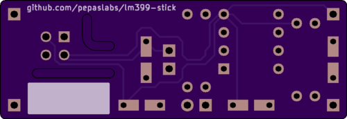
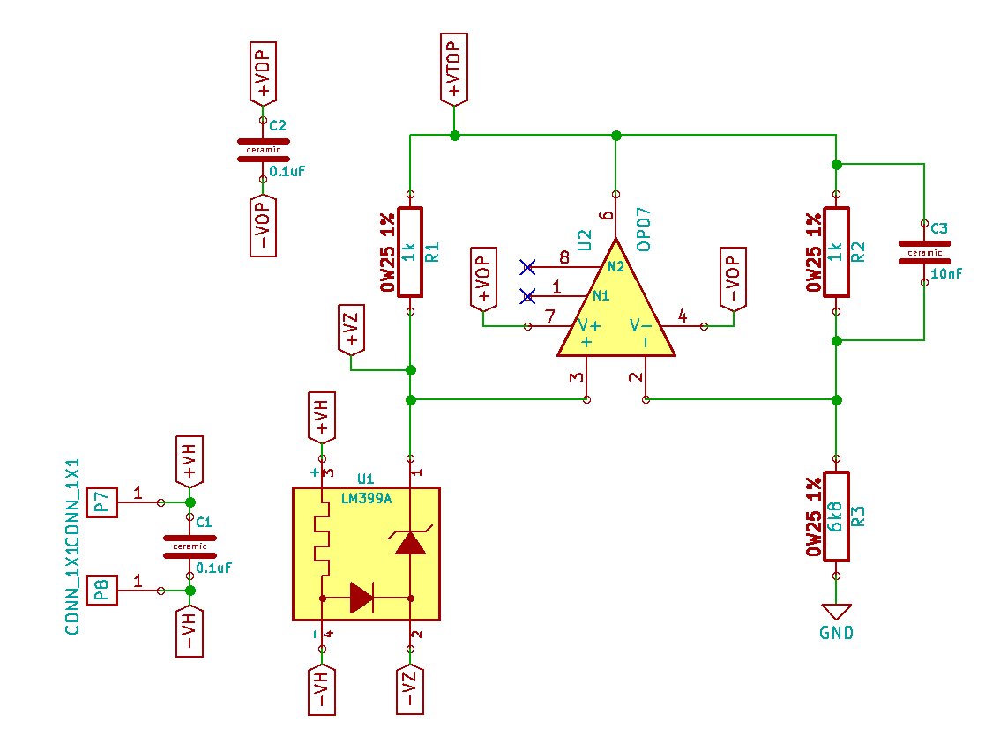

# small-lm399
A small LM399-based voltage reference board.

# Status

This board has not been tested (I'm awaiting PCB's to come in from OSHPark).

# Board design v1

Initial board design.

## Gerbers

[gerbers.zip](kicad/releases/v1/gerbers.zip)

## Schematic

.

# License

This board design is [Open-Source Hardware](http://www.oshwa.org/definition/).  It is licensed under the [MIT License](http://opensource.org/licenses/MIT).  It was designed by Jason Pepas.
