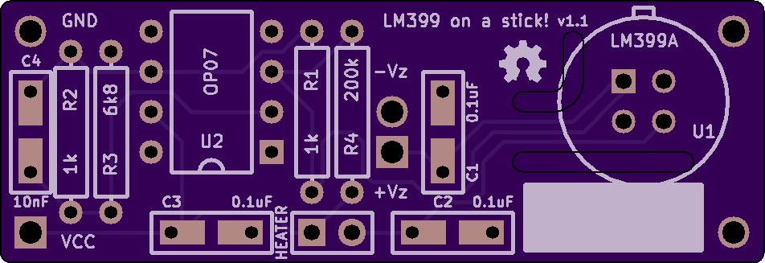
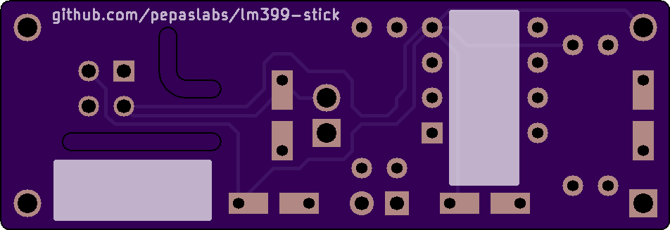
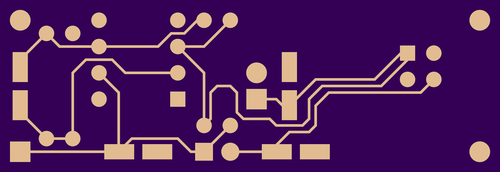
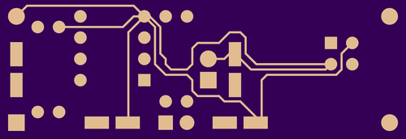

## lm399-stick v1.1

Schematic: [pdf](lm399-stick.pdf)

OSHPark: [link](https://oshpark.com/shared_projects/BuJlBa91)

### Changes from previous revision:
- Connector pins are widened for use with machine-pin headers.
